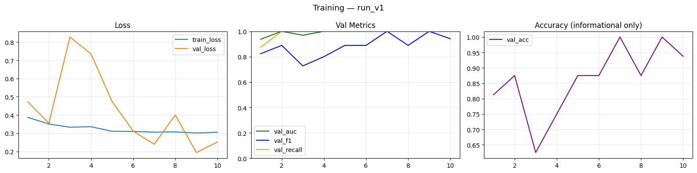
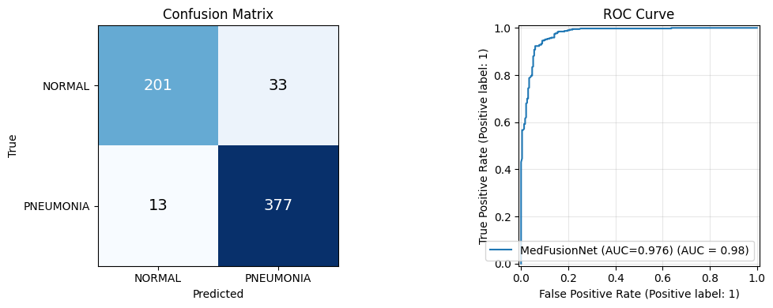

# DPR_PFA4IADO / MedFusionNet

MedFusionNet is a chest X-ray pneumonia detection project built around a hybrid deep-learning model and two practical entry points:

- `DPR_MedFusionNet/` for local Python and CLI inference
- `DPR_WebService/` for a local web interface with prediction, Grad-CAM, and benchmark reporting

The current training workflow lives in [`MedFusionNet_v4.ipynb`](./MedFusionNet_v4.ipynb) and is designed for Google Colab. The local Python package in this repository was split back out of that notebook so the trained model can be used cleanly outside Colab.

## Quick Links

- GitHub project: [carteeeltheboss/DPR_PFA4IADO](https://github.com/carteeeltheboss/DPR_PFA4IADO)
- Hugging Face model hub: [carteeeltheboss/DPR_PFA4IADO](https://huggingface.co/carteeeltheboss/DPR_PFA4IADO)
- Main training notebook: [`MedFusionNet_v4.ipynb`](./MedFusionNet_v4.ipynb)
- Local inference package: [`DPR_MedFusionNet/`](./DPR_MedFusionNet)
- Web interface: [`DPR_WebService/`](./DPR_WebService)
- License: [`LICENSE`](./LICENSE)

## Project Overview

This repository is organized around a simple idea:

1. Train the model in Google Colab, where GPU resources are easy to access.
2. Save checkpoints and logs in a stable run structure.
3. Bring the trained checkpoint back into the repository runtime.
4. Use the model locally through a Python API, CLI, or web interface.

The current deployed architecture is the `v4` notebook model:

- Swin Transformer Tiny backbone for global context
- DenseNet-121 backbone for local texture/detail extraction
- feature concatenation
- MLP fusion head for binary classification
- Grad-CAM explanations from the DenseNet branch
- local benchmark tooling for ROC, PR, confusion matrix, and score analysis

Important: the current local code is aligned with `MedFusionNet_v4.ipynb`, not older experimental architectures. If you retrain or change the model definition in the notebook, the Python package should be kept in sync.

## Repository Layout

```text
.
├── MedFusionNet_v4.ipynb              # Current Colab training notebook / source of truth
├── DPR_MedFusionNet/                  # Inference-focused Python runtime
│   ├── config.py
│   ├── checkpoint_utils.py
│   ├── model.py
│   ├── preprocessing.py
│   ├── inference.py
│   ├── predict.py
│   ├── requirements.txt
│   ├── requirements-colab.txt
│   ├── data/                          # Local dataset folder (ignored by git)
│   └── runs/                          # Local checkpoints folder (ignored by git except .gitkeep)
├── DPR_WebService/                    # Flask web UI for inference and benchmarking
│   ├── app.py
│   ├── service.py
│   ├── benchmark.py
│   ├── templates/
│   └── static/
└── DPR_tex/                           # Presentation / report material
```

## What the Model Does

MedFusionNet is a binary classifier for pediatric chest X-rays:

- `NORMAL`
- `PNEUMONIA`

At inference time, the local runtime provides:

- predicted class
- class probabilities
- pneumonia probability
- checkpoint metadata when available
- Grad-CAM heatmap
- Grad-CAM overlay image

The web service adds:

- checkpoint selection
- sample gallery from the test set
- image upload
- benchmark dashboard
- visual charts for model evaluation

## Current Architecture

The runtime in [`DPR_MedFusionNet/model.py`](./DPR_MedFusionNet/model.py) uses:

- `swin_tiny_patch4_window7_224`
- `densenet121`
- concatenation of both feature vectors
- a 3-layer fusion head:
  - `Linear(1792 -> 512)`
  - `Linear(512 -> 128)`
  - `Linear(128 -> 2)`

Input preprocessing matches the current inference path:

- resize to `224 x 224`
- convert to 3-channel tensor
- normalize with ImageNet mean/std

Grad-CAM is computed from the DenseNet `denseblock4` activations, because that branch still exposes spatial feature maps suitable for class activation mapping.

## Dataset

The project uses the Kaggle dataset:

- **Chest X-Ray Images (Pneumonia)** by Paul Mooney
- Kaggle identifier: `paultimothymooney/chest-xray-pneumonia`

Expected layout:

```text
data/
├── train/
│   ├── NORMAL/
│   └── PNEUMONIA/
├── val/
│   ├── NORMAL/
│   └── PNEUMONIA/
└── test/
    ├── NORMAL/
    └── PNEUMONIA/
```

The current notebook is tolerant to a missing validation split:

- if `val/` exists and contains enough images, it is used directly
- otherwise, the notebook carves a validation subset out of `train/`

The dataset counts observed in the current local copy are:

- `train`: `5216`
- `val`: `16`
- `test`: `624`

## Model Hub

The project also has a Hugging Face page:

- [https://huggingface.co/carteeeltheboss/DPR_PFA4IADO](https://huggingface.co/carteeeltheboss/DPR_PFA4IADO)

Use it for:

- checkpoint sharing
- model-card style documentation
- benchmark figures
- publishing a model artifact without committing large binaries into git

If you download a checkpoint from Hugging Face for local use, place it under:

```text
DPR_MedFusionNet/runs/<run_name>/checkpoints/
```

### Benchmark Preview

These reference benchmark images are also hosted on Hugging Face:





## Quick Start

### 1. Clone the repository

```bash
git clone https://github.com/carteeeltheboss/DPR_PFA4IADO.git
cd DPR_PFA4IADO
```

### 2. Create a virtual environment for the local runtime

```bash
cd DPR_MedFusionNet
python3 -m venv venv
source venv/bin/activate
pip install -r requirements.txt
pip install -r ../DPR_WebService/requirements.txt
cd ..
```

This single environment is enough for:

- CLI inference
- Python inference
- the Flask web app
- the benchmark dashboard

### 3. Make sure a checkpoint exists

The runtime expects checkpoints under:

```text
DPR_MedFusionNet/runs/<run_name>/checkpoints/
```

The local checkpoint resolver uses this priority order:

1. explicit `--checkpoint` path
2. `Model_<today>.pth`
3. latest `Model_*.pth`
4. latest `best.pth`
5. latest `last.pth`

This behavior is implemented in [`DPR_MedFusionNet/checkpoint_utils.py`](./DPR_MedFusionNet/checkpoint_utils.py).

## Using the Project

### Recommended: Web Interface

Start the local web service from the repository root:

```bash
./DPR_MedFusionNet/venv/bin/python DPR_WebService/app.py
```

Then open:

```text
http://127.0.0.1:8000
```

The web interface lets you:

- load the default checkpoint automatically
- switch to another checkpoint if needed
- upload your own image
- choose a sample test image
- shuffle the featured sample gallery
- see prediction probabilities
- inspect Grad-CAM and overlay images
- run a benchmark on the test set
- check service health through `/healthz`

The sample gallery is populated from:

```text
DPR_MedFusionNet/data/test/
```

### CLI Inference

Run a prediction on one image:

```bash
cd DPR_MedFusionNet
source venv/bin/activate

python predict.py \
  --image data/test/NORMAL/IM-0001-0001.jpeg \
  --save_vis runs/run_v1/outputs/example_gradcam.png
```

Run a directory-level batch prediction and export CSV:

```bash
python predict.py \
  --input_dir data/test \
  --output_csv runs/run_v1/outputs/test_predictions.csv \
  --no_cam
```

Supported input extensions are:

- `.png`
- `.jpg`
- `.jpeg`

### Python API

From the repository root:

```python
from DPR_MedFusionNet.inference import MedFusionInference

engine = MedFusionInference()

result = engine.predict("DPR_MedFusionNet/data/test/PNEUMONIA/person100_bacteria_475.jpeg")

print("Prediction:", result["pred_label"])
print("Pneumonia probability:", result["pneumonia_probability"])
print("Class probabilities:", result["probabilities"])
print("Checkpoint:", result["checkpoint_path"])

engine.visualize(
    result,
    save_path="DPR_MedFusionNet/runs/run_v1/outputs/python_gradcam.png",
    show=False,
)

engine.close()
```

The returned dictionary contains:

- `pred_label`
- `pred_probability`
- `pneumonia_probability`
- `probabilities`
- `checkpoint_path`
- `checkpoint_epoch`
- `checkpoint_auc`
- `image`
- `heatmap`
- `overlay`

## Benchmarking

The easiest way to benchmark the model is through the web interface:

1. start the app
2. open the `Benchmark` page
3. run the evaluation

The benchmark view reports:

- dataset size
- runtime duration
- accuracy
- ROC-AUC
- average precision
- sensitivity
- specificity
- pneumonia precision / recall / F1
- confusion matrix
- ROC curve
- precision-recall curve
- score distribution
- a list of the most confident misclassifications

Programmatically, the same benchmark logic is implemented in [`DPR_WebService/benchmark.py`](./DPR_WebService/benchmark.py).

## Training in Google Colab

Training is notebook-first and currently centered on [`MedFusionNet_v4.ipynb`](./MedFusionNet_v4.ipynb).

### Why training stays in Colab

This project was intentionally migrated to Colab for:

- GPU availability
- easier long-running training
- Drive-backed checkpoint persistence
- convenient Kaggle dataset download

The local repository is therefore focused on inference and deployment, while the notebook remains the training source of truth.

### Colab prerequisites

Before training, you should have:

- a Google account
- access to Google Colab
- a GPU runtime enabled in Colab
- a Kaggle API key
- enough Google Drive space for the dataset cache and run artifacts

### Training workflow

1. Open [`MedFusionNet_v4.ipynb`](./MedFusionNet_v4.ipynb) in Google Colab.
2. In Colab, enable a GPU runtime.
3. Set your Kaggle credentials in the `KAGGLE_JSON` variable.
4. Optionally change `RUN_NAME` for the new experiment.
5. Run the notebook from top to bottom.
6. Let Colab download or reuse the dataset cache.
7. Train until early stopping or until the target epoch budget is reached.
8. Use the saved checkpoint locally by copying it into `DPR_MedFusionNet/runs/<run_name>/checkpoints/`.

### What the notebook does

The notebook:

- mounts Google Drive
- installs notebook dependencies
- downloads the Kaggle dataset if it is not already cached
- copies the dataset to fast Colab runtime storage
- builds training, validation, and test loaders
- defines the hybrid model
- trains with differential learning rates
- evaluates with AUC, F1, recall, and accuracy
- saves checkpoints, logs, and outputs to Google Drive
- generates Grad-CAM and prediction artifacts

### Colab dependency set

The notebook installs or expects:

- `kaggle`
- `timm`
- `Pillow`
- `opencv-python-headless`
- `numpy`
- `scipy`
- `scikit-learn`
- `matplotlib`
- `tqdm`
- `pandas`

Reference file:

- [`DPR_MedFusionNet/requirements-colab.txt`](./DPR_MedFusionNet/requirements-colab.txt)

### Notebook training configuration

The current notebook configuration uses the following defaults:

| Parameter | Value |
|---|---:|
| `EPOCHS` | `40` |
| `BATCH_SIZE` | `16` |
| `NUM_WORKERS` | `2` |
| `VAL_SPLIT` | `0.10` |
| `LR_BACKBONE` | `1e-5` |
| `LR_HEAD` | `1e-3` |
| `LABEL_SMOOTHING` | `0.1` |
| `GRAD_CLIP` | `1.0` |
| `USE_AMP` | `True` |
| `EARLY_STOP_PATIENCE` | `8` |
| `SCHEDULER_T0` | `10` |
| `SCHEDULER_T_MULT` | `2` |

### Training-time augmentations

For training, the notebook currently applies:

- resize to `256 x 256`
- random crop to `224 x 224`
- random horizontal flip
- random rotation
- color jitter
- ImageNet normalization

For validation and test, the notebook uses:

- resize to `224 x 224`
- ImageNet normalization

### Optimizer, scheduler, and stopping logic

The notebook uses:

- `AdamW`
- differential learning rates between backbone and head
- `CosineAnnealingWarmRestarts`
- weighted cross-entropy to address class imbalance
- label smoothing
- gradient clipping
- early stopping based on validation AUC

### Colab output structure

The notebook writes to Google Drive in this layout:

```text
MyDrive/MedFusionNet_colab/
├── runs/<RUN_NAME>/
│   ├── checkpoints/
│   │   ├── best.pth
│   │   └── last.pth
│   ├── logs/
│   │   └── metrics.csv
│   └── outputs/
│       ├── test_predictions.csv
│       └── gradcam_results.png
└── dataset_cache/chest_xray/
```

### Moving a trained checkpoint back into the repo

After training in Colab:

1. download the desired `.pth` checkpoint
2. create a run folder locally if needed
3. place the file under `DPR_MedFusionNet/runs/<run_name>/checkpoints/`
4. optionally rename it to match the auto-selection pattern:
   - `Model_<day><Mon><yy>.pth`
5. start the web app or CLI and verify it loads correctly

Example:

```text
DPR_MedFusionNet/runs/run_v2/checkpoints/Model_19Apr26.pth
```

## Contribution Guide

Contributions are welcome, especially in:

- model improvements
- better evaluation and reporting
- inference/runtime robustness
- web UI usability
- documentation cleanup

### Recommended contribution workflow

1. Fork the repository.
2. Create a feature branch.
3. Make focused changes.
4. Test the affected workflow.
5. Open a pull request with a clear explanation of what changed and why.

### What contributors should update

If your change affects behavior, update the relevant parts of the repository:

- Python runtime in `DPR_MedFusionNet/`
- web UI in `DPR_WebService/`
- training notebook in `MedFusionNet_v4.ipynb`
- documentation in `README.md`

If you change the notebook architecture, also update:

- `DPR_MedFusionNet/model.py`
- checkpoint loading assumptions
- inference examples
- benchmark expectations

### What not to commit

Large or machine-specific artifacts should stay out of git. This repository already ignores items such as:

- `DPR_MedFusionNet/data/`
- `DPR_MedFusionNet/runs/`
- `DPR_MedFusionNet/venv/`
- `DPR_WebService/runtime/`
- Python cache folders

That means:

- do not commit datasets
- do not commit virtual environments
- do not commit generated runtime files
- do not commit large model binaries unless you explicitly intend to version them

For model distribution, prefer:

- Hugging Face
- GitHub Releases
- an external storage link documented in the PR

### Minimum verification before opening a PR

For inference changes:

```bash
./DPR_MedFusionNet/venv/bin/python DPR_MedFusionNet/predict.py \
  --image DPR_MedFusionNet/data/test/NORMAL/IM-0001-0001.jpeg \
  --no_cam
```

For web changes:

```bash
./DPR_MedFusionNet/venv/bin/python DPR_WebService/app.py
```

Then verify:

- the home page loads
- the default model loads
- one sample prediction works
- the benchmark page renders

If you modify training behavior, document:

- the notebook cells changed
- the new hyperparameters
- the expected checkpoint format
- any benchmark difference versus the previous default model

## Troubleshooting

### `Checkpoint not found`

Cause:

- no `.pth` file exists under `DPR_MedFusionNet/runs/**/checkpoints/`

Fix:

- place a checkpoint in that folder
- or pass an explicit checkpoint path

### `timm is required for MedFusionNet`

Cause:

- runtime dependencies were not installed

Fix:

```bash
source DPR_MedFusionNet/venv/bin/activate
pip install -r DPR_MedFusionNet/requirements.txt
```

### The web app starts but there are no sample images

Cause:

- `DPR_MedFusionNet/data/test/` is missing locally

Fix:

- copy the dataset locally
- or use upload-based inference instead of the sample gallery

### Colab runs out of memory

Try:

- lowering `BATCH_SIZE` from `16` to `8`
- re-running on a fresh GPU runtime
- keeping the notebook aligned with the current `224 x 224` setup

### I trained a new checkpoint but the local app still loads another one

Remember:

- auto-loading prefers `Model_<today>.pth`
- if that does not exist, it falls back to the latest `Model_*.pth`, then `best.pth`, then `last.pth`

If you want a specific file, either:

- rename it to the expected pattern
- or select it explicitly in the web UI / CLI

## License

This project is released under the MIT License.

See [`LICENSE`](./LICENSE) for the full text.

## Acknowledgements

- Paul Mooney for the Chest X-Ray Images (Pneumonia) dataset
- Google Colab for the training runtime
- Hugging Face for model-sharing infrastructure
- PyTorch, torchvision, timm, scikit-learn, Flask, and matplotlib for the core tooling
